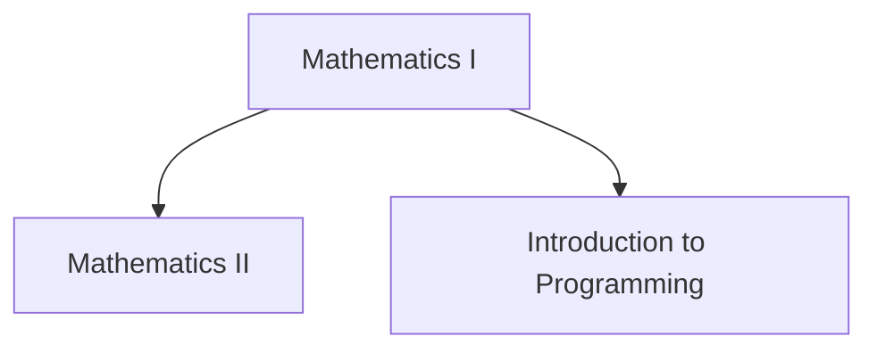

# Course Prerequisites Visualizer

An interactive web application that visualizes course prerequisite relationships from a Mermaid diagram. When hovering over a course node, the app highlights all prerequisite paths showing which courses must be completed beforehand.

Live demo: https://g-deluca.github.io/correlatividades-lcc/

## Features

- **Interactive Graph Visualization**: Built with ReactFlow for smooth pan, zoom, and interaction
- **Prerequisite Highlighting**: Hover over any course to see all its prerequisites highlighted
- **Mermaid Parser**: Automatically parses Mermaid flowchart diagrams at runtime
- **Extensible Architecture**: Designed to support future filtering features

## Getting Started

### Prerequisites

- Node.js (v18 or higher recommended)
- npm or yarn

### Installation

```bash
npm install
```

### Running the Development Server

```bash
npm run dev
```

The app will be available at `http://localhost:5173`

### Building for Production

```bash
npm run build
npm run preview
```

## Adding Your Course Data

Replace the sample diagram in `src/data/courses.mmd` with your actual course prerequisite structure.

### Mermaid Diagram Format



**Important**: Arrows should point from prerequisites TO the courses that require them.

## Project Structure

```
correlatividades/
├── src/
│   ├── components/
│   │   └── FlowChart.tsx          # Main visualization component
│   ├── utils/
│   │   ├── mermaidParser.ts       # Parses Mermaid diagrams
│   │   └── pathHighlighter.ts     # Prerequisite path logic
│   ├── data/
│   │   └── courses.mmd            # Your course prerequisite diagram
│   ├── App.tsx                    # App entry point
│   └── main.tsx                   # React entry point
├── package.json
└── vite.config.ts
```

## How It Works

1. **Parsing**: The Mermaid diagram is loaded and parsed into a graph structure (nodes and edges)
2. **Rendering**: ReactFlow renders the graph with interactive controls
3. **Interaction**: When hovering a node:
   - A depth-first search traverses backward through prerequisites
   - All prerequisite nodes and connecting edges are highlighted
   - Non-prerequisite elements are dimmed for clarity

## Future Enhancements

- **Filtering**: Filter the graph to show only courses related to a selected course
- **Course Details**: Click nodes to view detailed course information
- **Multiple Layouts**: Different automatic layout algorithms for better visualization
- **Export Options**: Export the visualization as an image

## Technologies Used

- **React** - UI framework
- **TypeScript** - Type safety
- **Vite** - Build tool
- **ReactFlow** - Graph visualization library
- **Mermaid** - Diagram parsing (syntax only, not for rendering)

## License

MIT
